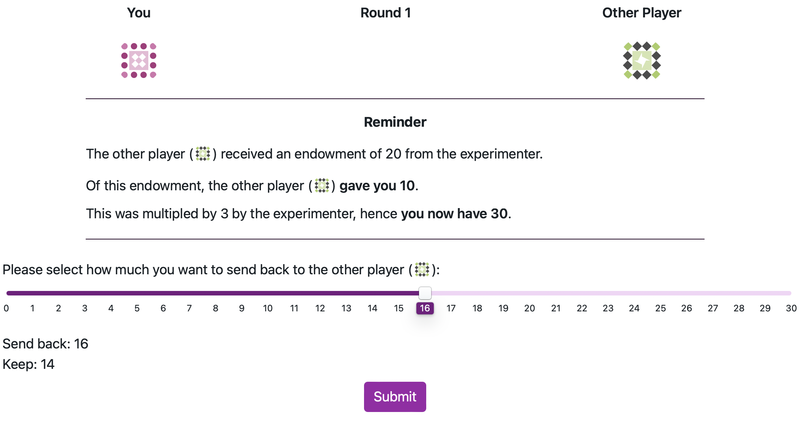

```{r setupCoaxsupp, include=FALSE}
knitr::opts_chunk$set(warning = FALSE, message = FALSE, echo = FALSE) 
knitr::opts_chunk$set(out.width = "\\textwidth")
library(papaja)
library(kableExtra)
library(knitr)

# using some functions dplyr, ggpubr, PairedData and sjPlot. Need to be loaded. 
library(tidyverse)
library(afex)
library(PairedData)
library(multcompView)
library(lsmeans)
library(depmixS4)
library(flextable)
library(gridExtra)
library(forcats)
library(ggsignif)

# Helper function to format p-values in APA style (3 decimal places, < .001 threshold)
format_p <- function(p) {
  ifelse(p < .001, "< .001", sub("^0\\.", ".", sprintf("%.3f", p)))
}
```

# A. Snapshot of the Repeated Trust Game as Seen by Participants {-}

Figure \@ref(fig:trustGameScreenshot) shows a screenshot of the repeated Trust Game at the moment the participant is required to make a decision of how much to send back to the Investor.

```{r trustGameScreenshot, include=T, fig.cap = "Screenshot of the RTG as seen by participants at the decision phase.", out.width="70%", fig.align='center'}



```

# B. Hidden Markov Model Used to Simulate the Investor's Actions {-}

The HMM assumes that the probability of each investment $I_t=0,…,20$, at each trial t, conditional on the current state of the investor $S_t$, is dependent on an underlying normal distribution with mean $\mu_s$ and standard deviation $\sigma_s$. The probability of each discrete investment was determined from the cumulative normal distribution $\Phi$, computing the probability of a Normal variate falling between the midway points of the response options. As responses were bounded at 0 and 20, we normalized these probabilities further by taking the endpoints into account. For instance, the probability of an investment $I_t=2$ is defined as: 

$$P(I_t=2 | S_t=s)= \frac{\Phi(2.5 | \mu_s,\sigma_s ) - \Phi(1.5 | \mu_s,\sigma_s )} {\Phi(20.5 | \mu_s,\sigma_s ) - \Phi(-0.5 | \mu_s,\sigma_s )}$$

Note that the denominator truncates the distribution between 0 and 20. To estimate the transition probability between states for the investor, a multinomial logistic regression model was fitted to the investor's data such as: 

$$P(S_{t+1} = s' | S_t=s , X_t = x)= \frac{\exp(\beta_{0,s,s'} + \beta_{1,s,s'} x)}{\sum_{s''} \exp(\beta_{0,s,s''} + \beta_{1,s,s''} x)}$$ 

where $X_t=R_t-I_t$ is the net return to the investor with  $R_t$ the amount returned by the trustee and $I_t$ is the Investment sent.

The advantages of this approach are that it does not require any a priori assumptions about the model features. The number of states, the policy conditional on the state, and the transition function between states can all be determined in a purely data-driven way. These HMMs can in turn be used to simulate a human-like agent playing the trust game. This agent may transition to a new state depending on the other player's actions and adopt a policy reflecting its state, thus simulating changes in emotional dispositions of human players during a repeated game. When the investor gains from the interaction, they become more likely to transition to a state where their policy is more "trusting" with generally higher investments. However, faced with losses, the investor is more likely to transition to a more cautious policy with generally lower investments. The policies and the transitions between states are sufficient to build an agent that reflects this type of adaptive behavior and reacts to the trustee's action choices in a way that mimics a human player.

We estimated a three-state model for the investor's behavior, using maximum likelihood estimation via the Expectation-Maximization algorithm as implemented in the depmixS4 package for R [@visser_depmixs4_2021]. The model was estimated using investments from existing datasets of human dyads playing 10 rounds of the RTG with the same trustee. The dataset consisted of a total of 381 games from two data sources: First, a total of 93 repeated trust games with healthy investors and a mix of healthy trustees and trustees diagnosed with Borderline Personality Disorder (BPD) [@king-casas_rupture_2008]. The second source was from data collected as part of a project investigating social exchanges in BPD and antisocial personality disorder reported elsewhere [@euler_interpersonal_2021; @huang_multidirectional_2020; @rifkin-zybutz_impaired_2021] and consists of 288 games. In both datasets, the investor on which we modeled the HMM's strategy was always selected from a healthy population and the trustees were a mix of healthy participants and those with personality disorders, allowing for a diversified interaction behavior. 

 
# C. Mixed-effects Models for Participant Returns {-}

We fit a linear mixed effects model to participant returns as a proportion of the multiplied investment received as described below. The results of the model are presented in Table \@ref(tab:myTableRet).

\[
\begin{split}
\text{R}_{ij} = & \, \beta_0 + \beta_1 \text{ Phase}_i + \beta_2 \text{ Condition}_i + \beta_3 \text{ Investment}_i + \beta_4 \text{ RS}_i + \\
& \beta_5 (\text{Phase} \times \text{Condition})_i + \beta_6 (\text{Phase} \times \text{Investment})_i + \beta_7 (\text{Phase} \times \text{RS})_i + \\
& \beta_8 (\text{Condition} \times \text{Investment})_i + \beta_9 (\text{Condition} \times \text{RS})_i + \beta_{10} (\text{Investment} \times \text{RS})_i + \\
& \beta_{11} (\text{Phase} \times \text{Condition} \times \text{Investment})_i + \beta_{12} (\text{Phase} \times \text{Condition} \times \text{RS})_i + \\
& \beta_{13} (\text{Phase} \times \text{Investment} \times \text{RS})_i + \beta_{14} (\text{Condition} \times \text{Investment} \times \text{RS})_i + \\
& \beta_{15} (\text{Phase} \times \text{Condition} \times \text{Investment} \times \text{RS})_i + \\
& b_{0j} + b_{1j} \text{ (Phase)}_i+ \epsilon_{ij}
\end{split}
\]

where:

- \( \text{R}_{ij} \): percentage of tripled investment returned to investor for participant \( j \) in observation \( i \)
- \( \beta_0 \): intercept
- \( \beta_1 \) to \( \beta_4 \): main effects of Phase (RTG pre vs. post-manipulation), Condition (manipulation vs. control), Investment, and RS (High vs Low RS), respectively
- \( \beta_5 \) to \( \beta_{10} \): interaction effects between each pair of the four factors, showing how the relationship between one factor and the return percentage changes depending on the level of another factor
- \( \beta_{11} \) to \( \beta_{14} \): three-way interaction effects among the four factors, indicating how the interaction between two factors is further modified by the third factor
- \( \beta_{15} \): four-way interaction effect between Phase, Condition, Investment, and RS, describing how the interaction among three factors is modified by the fourth factor
- \( b_{0j} \): player-wise random intercept for player \( j \)
- \( b_{1j} \): player-wise random slope for Phase for player \( j \)
- \( \epsilon_{ij} \): error term for player \( j \) in observation \( i \)


```{r, include=F}


# Create a summary object
model_summary <- readRDS("data/mod_returns_pct_RS.RDS")


# Extract the fixed effects as a data frame
mod_df <- as.data.frame(model_summary$coefficients)


mod_df <- mod_df %>%
  rownames_to_column(var = "Term") %>%
  mutate(Term = gsub("condition.f1", "Condition", Term),
         Term = gsub("phase.f1", "Phase", Term),
         Term = gsub("high_RS1", "RS_group", Term),
         Term = gsub("inv_scaled", "Investment", Term)) %>%
  mutate(`Pr(>|t|)` = format_p(`Pr(>|t|)`)) %>%
  mutate(across(where(is.numeric), ~round(., 2)))


```


```{r myTableRet, results='asis'}
# Create table using kable and kableExtra
kable(mod_df, 
      caption = "Summary of Mixed-Effects Model of participant returns across all rounds",
      booktabs = TRUE,
      align = c("l", "c", "c", "c", "c", "c")) %>%
  kable_styling(latex_options = c("striped", "hold_position"))
```


# D. Mixed-effects Models for HMM Investments {-}

We fit a linear mixed effects model to the investments sent by the HMM with Phase, Condition and RS groups as fixed effects, and player-wise intercepts. The results of the model are presented in Table \@ref(tab:myTableInv).

```{r, include=F}
# Create a summary object
model_inv <- readRDS("data/mod_invs_RS.RDS")


# Extract the fixed effects as a data frame
mod_df_inv <- as.data.frame(model_inv$coefficients)


mod_df_inv <- mod_df_inv %>%
  rownames_to_column(var = "Term") %>%
  mutate(Term = gsub("condition.f1", "Condition", Term),
         Term = gsub("phase.f1", "Phase", Term),
         Term = gsub("high_RS1", "RS_group", Term)) %>%
  mutate(`Pr(>|t|)` = format_p(`Pr(>|t|)`)) %>%
  mutate(across(where(is.numeric), ~round(., 2)))


```


```{r myTableInv, results='asis'}
# Create table using kable and kableExtra
kable(mod_df_inv, 
      caption = "Summary of Mixed-Effects Model of HMM investments across all rounds",
      booktabs = TRUE,
      align = c("l", "c", "c", "c", "c", "c")) %>%
  kable_styling(latex_options = c("striped", "hold_position"))
```


\pagebreak

# E. Exploitation Diagnostic Model {-}

We fit a mixed logistic regression model to predict whether a participant's return constituted exploitation (returning less than one-third of the tripled investment). The model included Phase, Condition, Investment (scaled), and RS group as fixed effects, with player-wise random intercepts. The results are presented in Table \@ref(tab:myTableExploit).

\[
\text{logit}(P(\text{Exploit}_{ij} = 1)) = \beta_0 + \beta_1 \text{ Phase}_i + \beta_2 \text{ Condition}_i + \beta_3 (\text{Phase} \times \text{Condition})_i + \beta_4 \text{ Investment}_i + \beta_5 \text{ RS}_i + b_{0j}
\]

where:

- \( \text{Exploit}_{ij} \): binary outcome indicating whether participant \( j \) returned less than one-third of the tripled investment in observation \( i \)
- \( \beta_0 \): intercept (log-odds)
- \( \beta_1 \) to \( \beta_3 \): fixed effects of Phase, Condition, and their interaction
- \( \beta_4 \), \( \beta_5 \): fixed effects of Investment (scaled) and RS group
- \( b_{0j} \): player-wise random intercept for player \( j \)


```{r, include=F}
mod_exploit_summary <- readRDS("data/mod_exploit.RDS")
mod_exploit_df <- as.data.frame(mod_exploit_summary$coefficients)

mod_exploit_df <- mod_exploit_df %>%
  rownames_to_column(var = "Term") %>%
  mutate(Term = gsub("condition.fManipulation", "Condition", Term),
         Term = gsub("phase.fpost", "Phase", Term),
         Term = gsub("high_RShigh RS", "RS_group", Term),
         Term = gsub("inv_scaled", "Investment", Term),
         Term = gsub("\\(Intercept\\)", "Intercept", Term)) %>%
  mutate(`Pr(>|z|)` = format_p(`Pr(>|z|)`)) %>%
  mutate(across(where(is.numeric), ~round(., 2)))
```


```{r myTableExploit, results='asis'}
kable(mod_exploit_df,
      caption = "Summary of Mixed Logistic Regression for Exploitation Probability",
      booktabs = TRUE,
      align = c("l", "c", "c", "c", "c")) %>%
  kable_styling(latex_options = c("striped", "hold_position"))
```


# F. Pre-Defection Returns Model {-}

To examine whether differences between conditions emerged before the pre-programmed low investment, we fit the same four-way mixed effects model as in Section C, restricted to rounds prior to the low investment (pre-phase: rounds 1–11; post-phase: rounds 1–12). The results are presented in Table \@ref(tab:myTablePredef).

\[
\begin{split}
\text{R}_{ij} = & \, \beta_0 + \beta_1 \text{ Phase}_i + \beta_2 \text{ Condition}_i + \beta_3 \text{ Investment}_i + \beta_4 \text{ RS}_i + \\
& \beta_5 (\text{Phase} \times \text{Condition})_i + \beta_6 (\text{Phase} \times \text{Investment})_i + \beta_7 (\text{Phase} \times \text{RS})_i + \\
& \beta_8 (\text{Condition} \times \text{Investment})_i + \beta_9 (\text{Condition} \times \text{RS})_i + \beta_{10} (\text{Investment} \times \text{RS})_i + \\
& \beta_{11} (\text{Phase} \times \text{Condition} \times \text{Investment})_i + \beta_{12} (\text{Phase} \times \text{Condition} \times \text{RS})_i + \\
& \beta_{13} (\text{Phase} \times \text{Investment} \times \text{RS})_i + \beta_{14} (\text{Condition} \times \text{Investment} \times \text{RS})_i + \\
& \beta_{15} (\text{Phase} \times \text{Condition} \times \text{Investment} \times \text{RS})_i + \\
& b_{0j} + b_{1j} \text{ (Phase)}_i+ \epsilon_{ij}
\end{split}
\]

All variables are defined as in Section C. The analysis is restricted to rounds before the pre-programmed low investment to test whether contrast effects were present prior to any trust violation.


```{r, include=F}
mod_predef_summary <- readRDS("data/mod_predef.RDS")
mod_predef_df <- as.data.frame(mod_predef_summary$coefficients)

mod_predef_df <- mod_predef_df %>%
  rownames_to_column(var = "Term") %>%
  mutate(Term = gsub("condition.f1", "Condition", Term),
         Term = gsub("phase.f1", "Phase", Term),
         Term = gsub("high_RS1", "RS_group", Term),
         Term = gsub("inv_scaled", "Investment", Term)) %>%
  mutate(`Pr(>|t|)` = format_p(`Pr(>|t|)`)) %>%
  mutate(across(where(is.numeric), ~round(., 2)))
```


```{r myTablePredef, results='asis'}
kable(mod_predef_df,
      caption = "Summary of Mixed-Effects Model of Participant Returns (Pre-Defection Rounds Only)",
      booktabs = TRUE,
      align = c("l", "c", "c", "c", "c", "c")) %>%
  kable_styling(latex_options = c("striped", "hold_position"))
```


# G. Event Study Model {-}

We fit a linear mixed effects model to participant returns within a 5-round window centered on the pre-programmed low investment ($t-2$ to $t+2$). The time_point factor uses custom contrasts to test the Drop (change at defection relative to $t-1$) and Recovery (change at $t+1$ relative to defection). The results are presented in Table \@ref(tab:myTableEvent).

\[
\begin{split}
\text{R}_{ij} = & \, \beta_0 + \beta_1 \text{ Phase}_i + \beta_2 \text{ Condition}_i + \beta_3 \text{ TimePoint}_i + \beta_4 \text{ RS}_i + \\
& \text{all two-way, three-way, and four-way interactions} + \\
& b_{0j} + \epsilon_{ij}
\end{split}
\]

where:

- \( \text{R}_{ij} \): percentage of tripled investment returned for participant \( j \) in observation \( i \)
- \( \text{TimePoint} \): factor with 5 levels ($t-2$, $t-1$, Defection, $t+1$, $t+2$) centered on the pre-programmed low investment round
- \( b_{0j} \): player-wise random intercept for player \( j \)

All other variables are defined as in Section C.


```{r, include=F}
mod_event_summary <- readRDS("data/mod_event.RDS")
mod_event_df <- as.data.frame(mod_event_summary$coefficients)

mod_event_df <- mod_event_df %>%
  rownames_to_column(var = "Term") %>%
  mutate(Term = gsub("condition.f1", "Condition", Term),
         Term = gsub("phase.f1", "Phase", Term),
         Term = gsub("high_RS1", "RS_group", Term),
         Term = gsub("time_point", "TimePoint_", Term)) %>%
  mutate(`Pr(>|t|)` = format_p(`Pr(>|t|)`)) %>%
  mutate(across(where(is.numeric), ~round(., 2)))
```


```{r myTableEvent, results='asis'}
kable(mod_event_df,
      caption = "Summary of Mixed-Effects Model for Event Study Analysis (Drop and Recovery)",
      booktabs = TRUE,
      align = c("l", "c", "c", "c", "c", "c")) %>%
  kable_styling(latex_options = c("striped", "hold_position"), font_size = 8)
```


# H. Exposure Phase Returns Model {-}

We fit a linear mixed effects model to participant returns during the three exposure phase games (expo1, expo2, expo3). The model includes Condition, Investment (scaled), and RS group as fixed effects with their three-way interaction, and player-wise random intercepts. The results are presented in Table \@ref(tab:myTableExpo).

\[
\begin{split}
\text{R}_{ij} = & \, \beta_0 + \beta_1 \text{ Condition}_i + \beta_2 \text{ Investment}_i + \beta_3 \text{ RS}_i + \\
& \beta_4 (\text{Condition} \times \text{Investment})_i + \beta_5 (\text{Condition} \times \text{RS})_i + \beta_6 (\text{Investment} \times \text{RS})_i + \\
& \beta_7 (\text{Condition} \times \text{Investment} \times \text{RS})_i + \\
& b_{0j} + \epsilon_{ij}
\end{split}
\]

where all variables are defined as in Section C, but Phase is absent because the exposure phase is a single time point.


```{r, include=F}
mod_expo_summary <- readRDS("data/mod_returns_expo.RDS")
mod_expo_df <- as.data.frame(mod_expo_summary$coefficients)

mod_expo_df <- mod_expo_df %>%
  rownames_to_column(var = "Term") %>%
  mutate(Term = gsub("condition.f1", "Condition", Term),
         Term = gsub("high_RS1", "RS_group", Term),
         Term = gsub("inv_scaled", "Investment", Term)) %>%
  mutate(`Pr(>|t|)` = format_p(`Pr(>|t|)`)) %>%
  mutate(across(where(is.numeric), ~round(., 2)))
```


```{r myTableExpo, results='asis'}
kable(mod_expo_df,
      caption = "Summary of Mixed-Effects Model of Participant Returns During Exposure Phase",
      booktabs = TRUE,
      align = c("l", "c", "c", "c", "c", "c")) %>%
  kable_styling(latex_options = c("striped", "hold_position"))
```

We additionally fit a linear mixed effects model to the HMM investments during the exposure phase with Condition and RS group as fixed effects, restricted to rounds 5 and above to allow sufficient time for the HMM's adaptive strategy to differentiate between conditions. The results are presented in Table \@ref(tab:myTableExpoInv).


```{r, include=F}
mod_expo_inv_summary <- readRDS("data/mod_invs_expo.RDS")
mod_expo_inv_df <- as.data.frame(mod_expo_inv_summary$coefficients)

mod_expo_inv_df <- mod_expo_inv_df %>%
  rownames_to_column(var = "Term") %>%
  mutate(Term = gsub("condition.f1", "Condition", Term),
         Term = gsub("high_RS1", "RS_group", Term)) %>%
  mutate(`Pr(>|t|)` = format_p(`Pr(>|t|)`)) %>%
  mutate(across(where(is.numeric), ~round(., 2)))
```


```{r myTableExpoInv, results='asis'}
kable(mod_expo_inv_df,
      caption = "Summary of Mixed-Effects Model of HMM Investments During Exposure Phase",
      booktabs = TRUE,
      align = c("l", "c", "c", "c", "c", "c")) %>%
  kable_styling(latex_options = c("striped", "hold_position"))
```


# I. Four-Way Interaction Slopes Analysis {-}

To decompose the significant four-way interaction (Phase $\times$ Condition $\times$ Investment $\times$ RS), we used `emtrends()` to estimate the marginal slope of investment on returns for each combination of Phase, Condition, and RS group. Custom contrasts then tested whether the investment slope changed from pre to post within each condition and RS group. The slopes and contrasts are presented in Tables \@ref(tab:myTableSlopes) and \@ref(tab:myTableSlopesContrasts).


```{r, include=F}
slopes_data <- readRDS("data/mod_slopes_4w.RDS")

slopes_df <- as.data.frame(slopes_data$slopes)
slopes_df <- slopes_df %>%
  mutate(across(where(is.numeric), ~round(., 3)))

contrasts_df <- as.data.frame(slopes_data$contrasts)
contrasts_df <- contrasts_df %>%
  mutate(p.value = format_p(p.value)) %>%
  mutate(across(where(is.numeric), ~round(., 3)))
```


```{r myTableSlopes, results='asis'}
kable(slopes_df,
      caption = "Estimated Marginal Slopes of Investment on Returns by Phase, Condition, and RS Group",
      booktabs = TRUE) %>%
  kable_styling(latex_options = c("striped", "hold_position"))
```


```{r myTableSlopesContrasts, results='asis'}
kable(contrasts_df,
      caption = "Pre-to-Post Slope Change Contrasts (Sidak-adjusted)",
      booktabs = TRUE) %>%
  kable_styling(latex_options = c("striped", "hold_position"))
```


# J. Player Rating Models {-}

We fit three separate linear mixed effects models to participants' ratings of their co-players: perceived cooperativeness, perceived forgiveness, and willingness to play again. Each model included Game Phase (pre, expo1, expo2, expo3, post), Condition, and RS group as fixed effects with their three-way interaction, and player-wise random intercepts. The results are presented in Tables \@ref(tab:myTableRatingCoop), \@ref(tab:myTableRatingForg), and \@ref(tab:myTableRatingAgain).

\[
\text{Rating}_{ij} = \beta_0 + \beta_1 \text{ GamePhase}_i + \beta_2 \text{ Condition}_i + \beta_3 \text{ RS}_i + \text{all interactions} + b_{0j} + \epsilon_{ij}
\]

where:

- \( \text{Rating}_{ij} \): the rating (cooperativeness, forgiveness, or willingness to play again) by participant \( j \) at phase \( i \)
- \( \text{GamePhase} \): factor with 5 levels (pre, expo1, expo2, expo3, post)
- All other variables are defined as in Section C


```{r, include=F}
mod_coop_summary <- readRDS("data/mod_rating_coop.RDS")
mod_coop_df <- as.data.frame(mod_coop_summary$coefficients)
mod_coop_df <- mod_coop_df %>%
  rownames_to_column(var = "Term") %>%
  mutate(Term = gsub("condition.f1", "Condition", Term),
         Term = gsub("high_RS1", "RS_group", Term),
         Term = gsub("gameNum.f", "Phase_", Term)) %>%
  mutate(`Pr(>|t|)` = format_p(`Pr(>|t|)`)) %>%
  mutate(across(where(is.numeric), ~round(., 2)))

mod_forg_summary <- readRDS("data/mod_rating_forg.RDS")
mod_forg_df <- as.data.frame(mod_forg_summary$coefficients)
mod_forg_df <- mod_forg_df %>%
  rownames_to_column(var = "Term") %>%
  mutate(Term = gsub("condition.f1", "Condition", Term),
         Term = gsub("high_RS1", "RS_group", Term),
         Term = gsub("gameNum.f", "Phase_", Term)) %>%
  mutate(`Pr(>|t|)` = format_p(`Pr(>|t|)`)) %>%
  mutate(across(where(is.numeric), ~round(., 2)))

mod_again_summary <- readRDS("data/mod_rating_again.RDS")
mod_again_df <- as.data.frame(mod_again_summary$coefficients)
mod_again_df <- mod_again_df %>%
  rownames_to_column(var = "Term") %>%
  mutate(Term = gsub("condition.f1", "Condition", Term),
         Term = gsub("high_RS1", "RS_group", Term),
         Term = gsub("gameNum.f", "Phase_", Term)) %>%
  mutate(`Pr(>|t|)` = format_p(`Pr(>|t|)`)) %>%
  mutate(across(where(is.numeric), ~round(., 2)))
```


```{r myTableRatingCoop, results='asis'}
kable(mod_coop_df,
      caption = "Summary of Mixed-Effects Model for Perceived Cooperativeness Ratings",
      booktabs = TRUE,
      align = c("l", "c", "c", "c", "c", "c")) %>%
  kable_styling(latex_options = c("striped", "hold_position"), font_size = 8)
```


```{r myTableRatingForg, results='asis'}
kable(mod_forg_df,
      caption = "Summary of Mixed-Effects Model for Perceived Forgiveness Ratings",
      booktabs = TRUE,
      align = c("l", "c", "c", "c", "c", "c")) %>%
  kable_styling(latex_options = c("striped", "hold_position"), font_size = 8)
```


```{r myTableRatingAgain, results='asis'}
kable(mod_again_df,
      caption = "Summary of Mixed-Effects Model for Willingness to Play Again Ratings",
      booktabs = TRUE,
      align = c("l", "c", "c", "c", "c", "c")) %>%
  kable_styling(latex_options = c("striped", "hold_position"), font_size = 8)
```


\pagebreak


# References {-}